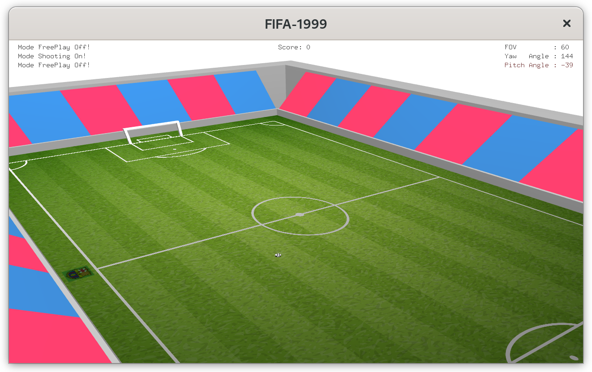

# FIFA-1999-Computer-Graphics-Game

<object data="FIFA 1999 Report.pdf" type="application/pdf" width="100%" height="800px">
  
You can find more information in <a href="FIFA 1999 Report.pdf">FIFA 1999 Report.pdf</a> !

</object>

- I still remember spending a long time registering for my first FIFA14 account on the iPad when I was a kid, and since
  then, FIFA or now the mobile version of PES has always been with me. No matter of playing FIFA was good or bad is not
  worth judging, but thinking back on this experience makes me feel nostalgic and amazed.
- For this assignment, I tried to create a first-person football game and attempted to recreate the appearance of Camp
  Nou, which I have never visited before.
- Although many desired features could not be implemented due to the deadline, overall, I am satisfied with the
  result.

